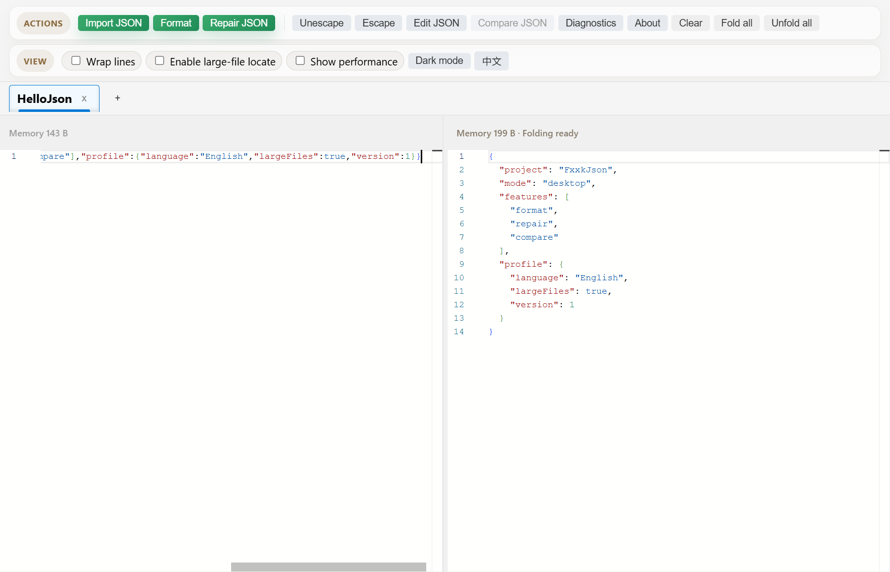
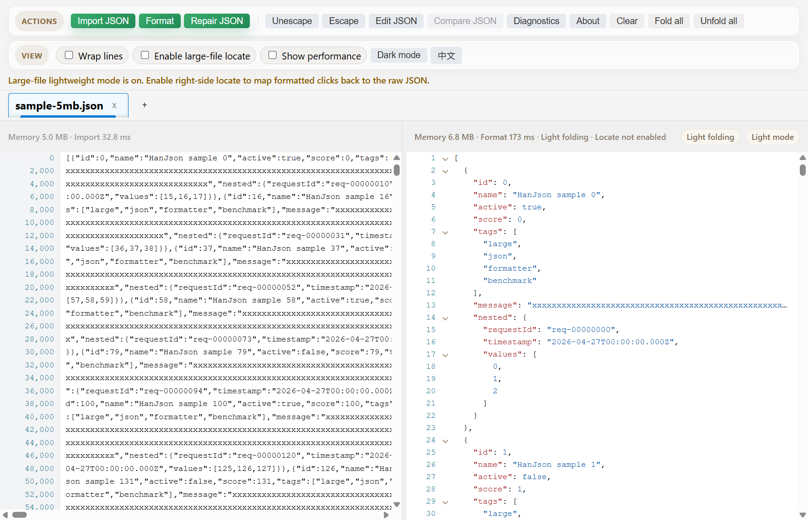
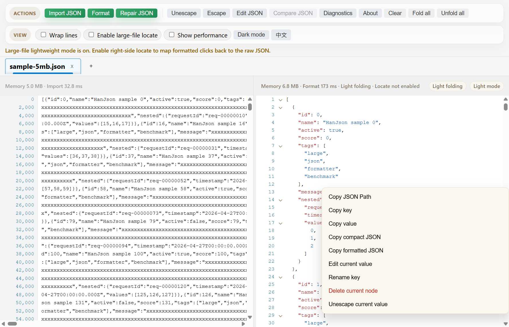
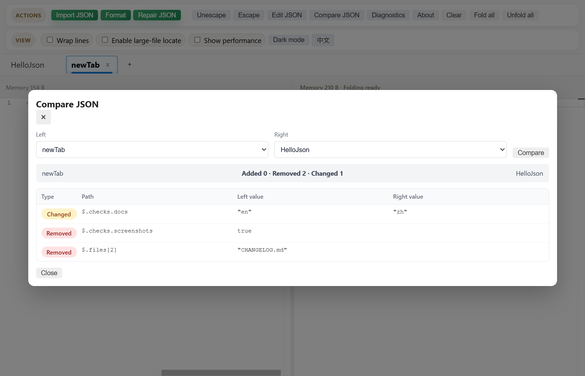

<div align="center">
  
  <h1>FxxkJson</h1>
  <p>A local-first desktop JSON formatter, repair tool, search workspace, comparer, and large-file inspector.</p>
  <p><a href="README.md">简体中文</a> | <strong>English</strong></p>

  <p>
    <a href="https://github.com/Aaronsound/FxxkJson/actions/workflows/ci.yml"></a>
    <a href="https://github.com/Aaronsound/FxxkJson/releases/latest"></a>
    <a href="LICENSE"></a>
  </p>
</div>

FxxkJson is built with Electron, React, Vite, and Monaco Editor. It is designed for API responses, logs, configuration files, and 5MB+ JSON documents. JSON processing happens locally on your machine; the app does not upload JSON content and does not include telemetry or remote JSON processing.

## Download

Download the latest desktop package from [Latest Release](https://github.com/Aaronsound/FxxkJson/releases/latest).

| Platform | File | Notes |
| --- | --- | --- |
| Windows x64 | `windows-x64-*.exe` | Installer |
| macOS Apple Silicon | `macos-arm64-*.dmg` | Recommended for M1 / M2 / M3 / M4 Macs |
| macOS Intel | `macos-x64-*.dmg` | Intel Macs |
| Zip packages | `*.zip` | Alternative distribution |

Current builds are unsigned, so macOS Gatekeeper or Windows SmartScreen may show warnings. Make sure you download packages from this repository's Releases page.

## Screenshots

### Main Window



### Large JSON Viewer



### Node Context Menu



### JSON Compare



## What It Does

- Paste or import JSON and inspect formatted output.
- Repair common malformed JSON.
- Escape and unescape JSON strings.
- Search and replace raw JSON on the left.
- Search, fold, copy values, and copy JSON Path from the formatted result.
- Edit the current node, delete nodes, and rename keys.
- Manage multiple tabs and compare JSON differences between two tabs.
- Browse 5MB+ JSON files with a virtualized large-file viewer.
- Optionally map right-side clicks back to the raw JSON for large files.
- Use performance details and diagnostics logs to troubleshoot large-file workflows.

## Privacy

FxxkJson processes JSON locally in the desktop app. The project does not include analytics, telemetry uploads, or remote JSON processing. Please avoid sharing private JSON, credentials, tokens, or user data in issues, screenshots, or logs.

## Development

Requirements: Node.js 22+ and npm.

```bash
npm install
npm run dev        # run the Electron + Vite dev app
npm run typecheck  # type-check renderer and Electron sources
npm test           # run Vitest tests
npm run build      # build renderer and Electron output
npm run check      # text check + typecheck + test + smoke + build
npm start          # run the built desktop app after npm run build
```

Packaging:

```bash
npm run dist:mac
npm run dist:win
npm run dist
```

Generated installers are written to `release/`.

If Electron binary download is slow or interrupted, run:

```bash
npm run setup:electron
```

or set a mirror for one install:

```bash
ELECTRON_MIRROR=https://npmmirror.com/mirrors/electron/ npm install
```

## Large JSON Notes

- Files at or above `5MB` enter large-file mode.
- Formatted output at or above `5MB` uses the dedicated readonly viewer instead of a second Monaco model.
- Large-file locate data is built lazily or deferred to keep scrolling and interaction responsive.
- Generated samples live in `json/`; that directory is intentionally ignored by git.
- `npm run smoke` exercises a lightweight core flow without opening the desktop UI.
- `npm run perf:regression` measures local 5MB/20MB sample performance and can compare against a committed baseline.

## Contributing, Security, License

- Contributing: [CONTRIBUTING.md](CONTRIBUTING.md)
- Security: [SECURITY.md](SECURITY.md)
- Changelog: [CHANGELOG.md](CHANGELOG.md)
- License: [MIT](LICENSE)
