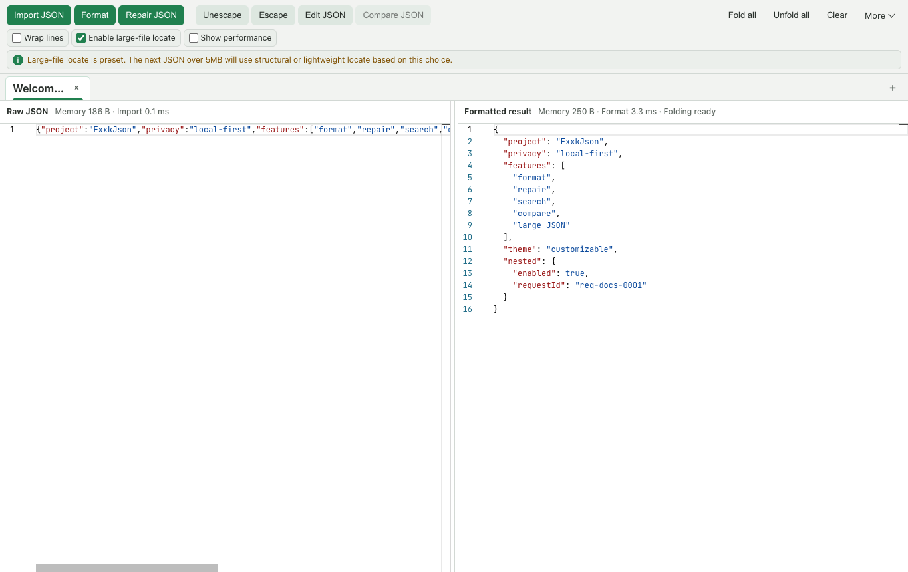

<div align="center">
  
  <h1>FxxkJson</h1>
  <p>A local-first desktop JSON formatter, repair tool, search workspace, comparer, and large-file inspector.</p>
  <p><a href="README.md">简体中文</a> | <strong>English</strong></p>

  <p>
    <a href="https://github.com/Aaronsound/FxxkJson/releases/latest"></a>
    <a href="https://github.com/Aaronsound/FxxkJson/actions/workflows/ci.yml"></a>
    <a href="https://github.com/Aaronsound/FxxkJson/releases/latest"></a>
    <a href="LICENSE"></a>
  </p>
</div>

FxxkJson is built with Electron, React, Vite, and Monaco Editor for API responses, logs, configuration files, and 5MB+ JSON documents. Large files use a dedicated readonly viewer, virtual scrolling, and deferred indexing, with continuous performance and Electron E2E regression coverage using 20MB fixtures. JSON processing happens locally and is never uploaded.

**Quick links:** [English User Guide](docs/USER_GUIDE.en.md) · [中文使用指南](docs/USER_GUIDE.md) · [Download the latest release](https://github.com/Aaronsound/FxxkJson/releases/latest)



> The animated demo is assembled from real Electron screenshots and cycles through the main workspace, large-file viewer, node actions, and JSON comparison.

## Why FxxkJson

| | Capability | What it means |
| --- | --- | --- |
| ⚡ | Large-file first | 5MB+ documents automatically use a dedicated viewing mode, guarded by 5MB/20MB performance and packaged-app regression tests. |
| 🔒 | Local processing | JSON is never uploaded; there is no analytics SDK, telemetry upload, or remote processing path. |
| 🧰 | Complete workflow | Format, repair, search and replace, node editing, JSON Path, tabs, and structural comparison live in one desktop workspace. |
| 🖥️ | Cross-platform builds | Installers are published for Windows x64, macOS Apple Silicon, and macOS Intel. |

## Download

Download the latest desktop package from [Latest Release](https://github.com/Aaronsound/FxxkJson/releases/latest).

| Platform | File | Notes |
| --- | --- | --- |
| Windows x64 | `windows-x64-*.exe` | Installer |
| macOS Apple Silicon | `macos-arm64-*.dmg` | Recommended for M1 / M2 / M3 / M4 Macs |
| macOS Intel | `macos-x64-*.dmg` | Intel Macs |
| Zip packages | `*.zip` | Alternative distribution |

Current builds are unsigned, so macOS Gatekeeper or Windows SmartScreen may show warnings. Make sure you download packages from this repository's Releases page.

## Start in 30 Seconds

1. Download and open the installer that matches your system.
2. Paste JSON on the left, select **Import JSON**, or drag a file into the window.
3. Inspect the formatted result on the right, then search, fold, or right-click a node when needed.

[Read the complete English user guide →](docs/USER_GUIDE.en.md)

## What It Does

- Paste or import JSON and inspect formatted output.
- Repair common malformed JSON.
- Escape and unescape JSON strings.
- Search and replace raw JSON on the left.
- Search, fold, copy values, and copy JSON Path from the formatted result.
- Edit the current node, delete nodes, and rename keys.
- Manage multiple tabs and compare JSON differences between two tabs.
- Work with many tabs through a fixed add button, scroll controls, and keyboard navigation.
- Choose Emerald, Mist Blue, Graphite, Obsidian, Blue, Indigo, or Violet; the preference is stored locally and works in dark mode.
- Use responsive toolbars, menus, and dialogs in narrow windows, and drag the center splitter to resize either pane.
- Browse 5MB+ JSON files with a virtualized large-file viewer.
- Optionally map right-side clicks back to the raw JSON for large files; compact indexes and incremental node edits keep folding, locating, and editing efficient.
- Use performance details and diagnostics logs to troubleshoot large-file workflows.

## More Screenshots

<details>
<summary>Expand four English UI screenshots</summary>

### Main Window


### Large JSON Viewer


### Node Context Menu


### JSON Compare


</details>

## Project Evolution

FxxkJson is a refactor and hardening of [HanJson](https://github.com/Aaronsound/HanJson). It is not a completely separate rewrite; it continues the same desktop JSON formatting tool lineage:

- HanJson started with Create React App, then added the Electron desktop runtime, a Monaco Editor two-pane workflow, worker-based formatting, and `jsonc-parser` node-location support.
- The project later moved to a Vite-based build, referenced in the early FxxkJson history as `HanJson-vite`, to improve Electron + Monaco worker packaging, local startup, and build behavior.
- FxxkJson keeps the Electron, React, Vite, and Monaco Editor stack while splitting the previously centralized UI, state, search, editing, and worker logic into components, hooks, utils, and workers.
- For 5MB+ JSON documents, FxxkJson no longer relies only on a second Monaco model on the right. It adds a dedicated readonly large-file viewer, virtual scrolling, deferred indexing, performance details, diagnostics logs, automated tests, and release checks.

Monaco Editor is the editor engine, while Vite is the build tool. They coexist in the current architecture rather than replacing one another.

## Privacy

FxxkJson processes JSON locally in the desktop app. The project does not include analytics, telemetry uploads, or remote JSON processing. Please avoid sharing private JSON, credentials, tokens, or user data in issues, screenshots, or logs.

## Development

Requirements: Node.js 22+ and npm.

```bash
npm install
npm run dev        # run the Electron + Vite dev app
npm run typecheck  # type-check renderer and Electron sources
npm test           # run Vitest tests
npm run build      # build renderer and Electron output
npm run check      # text check + typecheck + test + smoke + build
npm run docs:screenshots # regenerate bilingual Electron screenshots and animated demos
npm run docs:demo        # rebuild animated demos from the existing screenshots only
npm start          # run the built desktop app after npm run build
```

Packaging:

```bash
npm run dist:mac
npm run dist:win
npm run dist
```

Generated installers are written to `release/`.

If Electron binary download is slow or interrupted, run:

```bash
npm run setup:electron
```

or set a mirror for one install:

```bash
ELECTRON_MIRROR=https://npmmirror.com/mirrors/electron/ npm install
```

## Large JSON Notes

- Files at or above `5MB` enter large-file mode.
- Formatted output at or above `5MB` uses the dedicated readonly viewer instead of a second Monaco model.
- Large-file locate data is built lazily or deferred to keep scrolling and interaction responsive.
- Generated samples live in `json/`; that directory is intentionally ignored by git.
- `npm run smoke` exercises a lightweight core flow without opening the desktop UI.
- `npm run perf:regression` measures local 5MB/20MB sample performance and can compare against a committed baseline.

## Contributing, Security, License

- Contributing: [CONTRIBUTING.md](CONTRIBUTING.md)
- Security: [SECURITY.md](SECURITY.md)
- Changelog: [CHANGELOG.md](CHANGELOG.md)
- License: [MIT](LICENSE)
