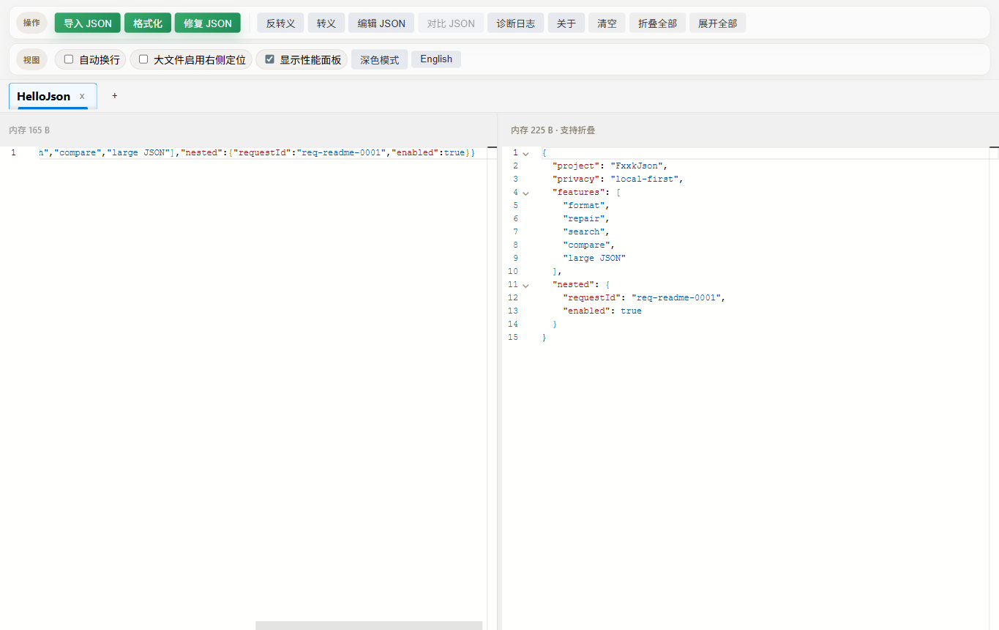
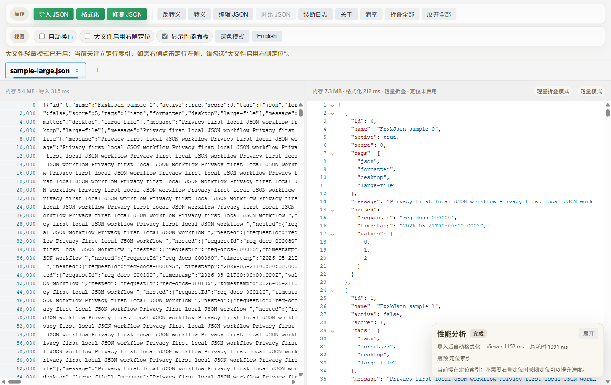
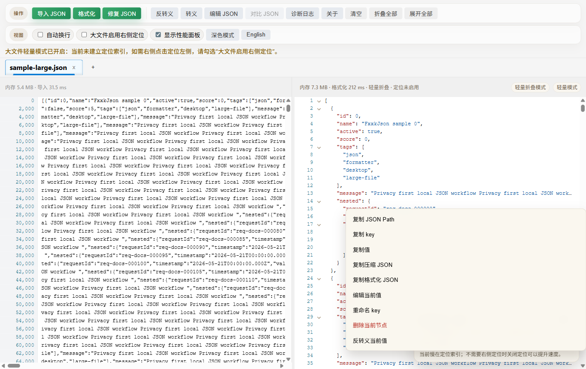
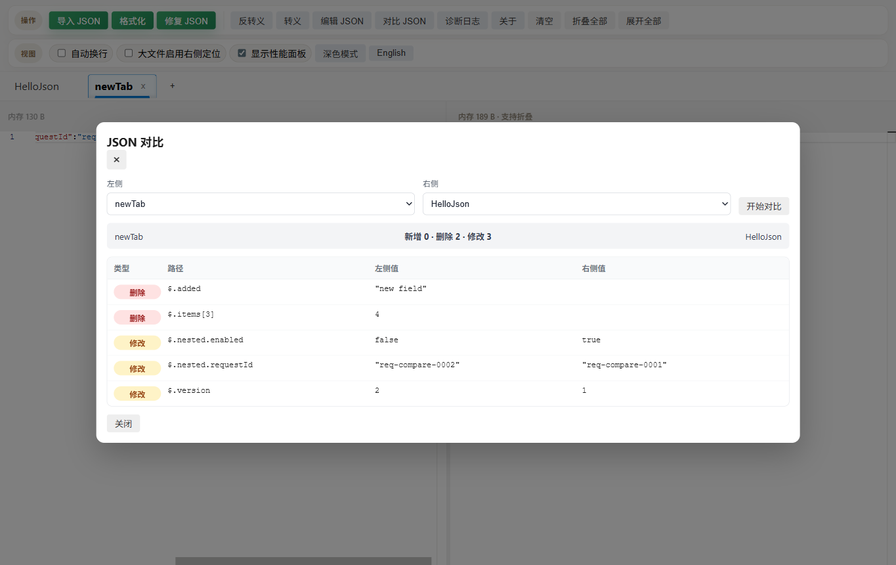

<div align="center">
  
  <h1>FxxkJson</h1>
  <p>本地优先的桌面 JSON 格式化、修复、搜索、编辑、对比和大文件查看工具。</p>
  <p><strong>简体中文</strong> | <a href="README.en.md">English</a></p>

  <p>
    <a href="https://github.com/Aaronsound/FxxkJson/actions/workflows/ci.yml"></a>
    <a href="https://github.com/Aaronsound/FxxkJson/releases/latest"></a>
    <a href="LICENSE"></a>
  </p>
</div>

FxxkJson 基于 Electron、React、Vite 和 Monaco Editor 构建，适合处理接口响应、日志、配置文件和 5MB+ 的大 JSON。所有 JSON 处理都在本机完成，不上传数据，不包含遥测或远程 JSON 处理逻辑。

## 下载

从 [Latest Release](https://github.com/Aaronsound/FxxkJson/releases/latest) 下载最新桌面安装包。

| 平台 | 下载文件 | 说明 |
| --- | --- | --- |
| Windows x64 | `windows-x64-*.exe` | 常规安装包 |
| macOS Apple Silicon | `macos-arm64-*.dmg` | M1 / M2 / M3 / M4 芯片推荐 |
| macOS Intel | `macos-x64-*.dmg` | Intel 芯片 Mac |
| 压缩包 | `*.zip` | 备用分发包 |

当前发布包未签名，macOS Gatekeeper 或 Windows SmartScreen 可能会提示风险。请确认你从本仓库 Releases 下载。

## 截图

### 主界面



### 大 JSON 查看器



### 节点右键操作



### JSON 对比



## 你可以用它做什么

- 粘贴或导入 JSON，并在右侧查看格式化结果。
- 修复常见的非标准 JSON 文本。
- 对字符串做转义和反转义。
- 在左侧原始 JSON 中搜索和替换。
- 在右侧格式化结果中搜索、折叠、复制值、复制 JSON Path。
- 编辑当前节点、删除节点、重命名 key。
- 多标签管理不同 JSON，并对比两个标签中的 JSON 差异。
- 查看 5MB+ 大文件，使用虚拟滚动保持界面响应。
- 可选开启大文件右侧点击定位，帮助从格式化视图定位回原始 JSON。
- 查看性能面板和诊断日志，排查大文件导入、格式化、搜索和定位问题。

## 隐私

FxxkJson 的 JSON 处理都在本机桌面应用中完成。项目不包含分析 SDK、遥测上传或远程 JSON 处理逻辑。请仍然避免在 issue、截图或日志中公开私密 JSON、密钥、token 或用户数据。

## 开发

需要 Node.js 22+ 和 npm。

```bash
npm install
npm run dev        # 启动 Electron + Vite 开发环境
npm run typecheck  # 检查 renderer 和 Electron TypeScript
npm test           # 运行 Vitest
npm run build      # 构建 renderer 和 Electron 输出
npm run check      # 文本检查 + 类型检查 + 测试 + smoke + 构建
npm start          # npm run build 后运行桌面应用
```

打包命令：

```bash
npm run dist:mac
npm run dist:win
npm run dist
```

生成文件会写入 `release/`。

如果 Electron 下载较慢，可以运行：

```bash
npm run setup:electron
```

或为单次安装设置镜像：

```bash
ELECTRON_MIRROR=https://npmmirror.com/mirrors/electron/ npm install
```

## 大文件说明

- 原始或格式化结果达到 `5MB` 后会进入大文件模式。
- 右侧格式化结果达到 `5MB` 后会使用专用只读查看器，而不是第二个 Monaco 编辑器。
- 大文件定位索引会按需或延迟构建，以优先保证滚动和交互流畅。
- `json/` 目录用于本地生成测试样本，已被 git 忽略。
- `npm run smoke` 会在不打开桌面窗口的情况下跑核心格式化、搜索、编辑、修复流程。
- `npm run perf:regression` 可用 5MB/20MB 样本做性能回归检查。

## 贡献与安全

- 贡献指南：[CONTRIBUTING.md](CONTRIBUTING.md)
- 安全策略：[SECURITY.md](SECURITY.md)
- 变更记录：[CHANGELOG.md](CHANGELOG.md)
- 许可证：[MIT](LICENSE)
