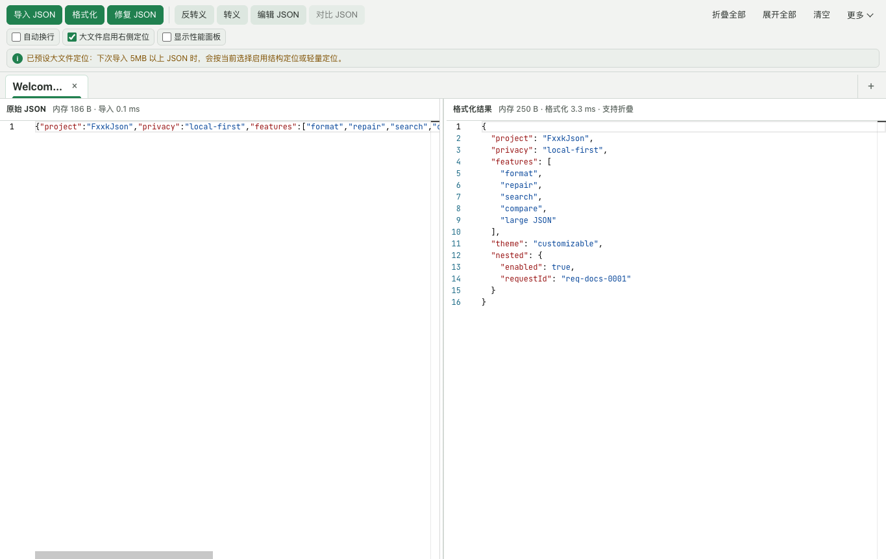

<div align="center">
  
  <h1>FxxkJson</h1>
  <p>本地优先的桌面 JSON 格式化、修复、搜索、编辑、对比和大文件查看工具。</p>
  <p><strong>简体中文</strong> | <a href="README.en.md">English</a></p>

  <p>
    <a href="https://github.com/Aaronsound/FxxkJson/releases/latest"></a>
    <a href="https://github.com/Aaronsound/FxxkJson/actions/workflows/ci.yml"></a>
    <a href="https://github.com/Aaronsound/FxxkJson/releases/latest"></a>
    <a href="LICENSE"></a>
  </p>
</div>

FxxkJson 基于 Electron、React、Vite 和 Monaco Editor 构建，适合处理接口响应、日志、配置文件和 5MB+ 的大 JSON。针对大文件提供专用只读查看器、虚拟滚动和延迟索引，并使用 20MB 样本持续做性能与 Electron E2E 回归。所有 JSON 处理都在本机完成，不上传数据。

**快速入口：** [中文使用指南](docs/USER_GUIDE.md) · [English User Guide](docs/USER_GUIDE.en.md) · [下载最新版](https://github.com/Aaronsound/FxxkJson/releases/latest)



> 动态演示由真实 Electron 应用截图自动合成，依次展示主界面、大文件查看、节点右键操作和 JSON 对比。

## 为什么选择 FxxkJson

| | 能力 | 说明 |
| --- | --- | --- |
| ⚡ | 大文件优先 | 5MB+ 自动进入专用查看模式；5MB/20MB 性能回归和打包应用测试防止体验退化。 |
| 🔒 | 本地处理 | JSON 不上传，不包含分析 SDK、遥测或远程处理逻辑。 |
| 🧰 | 完整工作流 | 格式化、修复、搜索替换、节点编辑、JSON Path、多标签和结构对比集中在一个桌面工作区。 |
| 🖥️ | 双平台发布 | 同时提供 Windows x64、macOS Apple Silicon 和 macOS Intel 安装包。 |

## 下载

从 [Latest Release](https://github.com/Aaronsound/FxxkJson/releases/latest) 下载最新桌面安装包。

| 平台 | 下载文件 | 说明 |
| --- | --- | --- |
| Windows x64 | `windows-x64-*.exe` | 常规安装包 |
| macOS Apple Silicon | `macos-arm64-*.dmg` | M1 / M2 / M3 / M4 芯片推荐 |
| macOS Intel | `macos-x64-*.dmg` | Intel 芯片 Mac |
| 压缩包 | `*.zip` | 备用分发包 |

当前发布包未签名，macOS Gatekeeper 或 Windows SmartScreen 可能会提示风险。请确认你从本仓库 Releases 下载。

## 30 秒上手

1. 下载并打开与你系统匹配的安装包。
2. 把 JSON 粘贴到左侧、点击“导入 JSON”，或者直接将文件拖进窗口。
3. 查看右侧自动生成的格式化结果；需要时使用搜索、折叠或右键节点操作。

[查看完整中文使用指南 →](docs/USER_GUIDE.md)

## 你可以用它做什么

- 粘贴或导入 JSON，并在右侧查看格式化结果。
- 修复常见的非标准 JSON 文本。
- 对字符串做转义和反转义。
- 在左侧原始 JSON 中搜索和替换。
- 在右侧格式化结果中搜索、折叠、复制值、复制 JSON Path。
- 编辑当前节点、删除节点、重命名 key。
- 多标签管理不同 JSON，并对比两个标签中的 JSON 差异。
- 使用固定新增入口、标签滚动按钮和键盘操作管理多个标签。
- 在翡翠绿、雾霾蓝、石墨灰、经典黑、蓝色、靛蓝和紫色之间切换，设置会在本机保存，并兼容深色模式。
- 在窄窗口中使用响应式工具栏、菜单和弹窗；双栏分隔线可以左右拖动。
- 查看 5MB+ 大文件，使用虚拟滚动保持界面响应。
- 可选开启大文件右侧点击定位，帮助从格式化视图定位回原始 JSON；折叠、定位和节点编辑使用紧凑索引及增量更新降低开销。
- 查看性能面板和诊断日志，排查大文件导入、格式化、搜索和定位问题。

## 更多界面

<details>
<summary>展开查看 4 张中文界面截图</summary>

### 主界面


### 大 JSON 查看器


### 节点右键操作


### JSON 对比


</details>

## 项目演进

FxxkJson 是 [HanJson](https://github.com/Aaronsound/HanJson) 的重构优化版。它不是从零开始的新工具，而是在原有 JSON 格式化工具经验上继续演进：

- HanJson 起步于 Create React App，后续加入 Electron 桌面运行、Monaco Editor 双栏编辑器、worker 后台格式化和 `jsonc-parser` 节点定位能力。
- 中间迁移到 Vite 构建链，也就是早期提交中提到的 `HanJson-vite`，用于改善 Electron + Monaco worker 的打包路径、开发启动和构建体验。
- FxxkJson 在此基础上继续重命名和重构，保留 Electron、React、Vite 和 Monaco Editor 技术栈，同时把原本集中的界面、状态、搜索、编辑和 worker 逻辑拆分到 components、hooks、utils 和 workers。
- 针对 5MB+ 大 JSON，FxxkJson 不再只依赖右侧第二个 Monaco 编辑器，而是增加专用只读大文件查看器、虚拟滚动、延迟索引、性能面板、诊断日志、自动化测试和发布检查。

Monaco Editor 是编辑器内核，Vite 是构建工具；二者在当前架构中并行存在，不是互相替代关系。

## 隐私

FxxkJson 的 JSON 处理都在本机桌面应用中完成。项目不包含分析 SDK、遥测上传或远程 JSON 处理逻辑。请仍然避免在 issue、截图或日志中公开私密 JSON、密钥、token 或用户数据。

## 开发

需要 Node.js 22+ 和 npm。

```bash
npm install
npm run dev          # 启动 Electron + Vite 开发环境
npm run format:check # 检查仓库格式化
npm run lint         # 运行 Biome lint 检查
npm run typecheck    # 检查 renderer 和 Electron TypeScript
npm test             # 运行 Vitest
npm run coverage     # 输出 Vitest 覆盖率摘要
npm run smoke        # 运行核心 JSON 流程 smoke 测试
npm run build        # 构建 renderer 和 Electron 输出
npm run bundle:size  # 输出构建产物体积
npm run check        # 文本检查 + 格式化 + lint + 类型检查 + 覆盖率 + smoke + 构建 + 包体积
npm run docs:screenshots # 重新生成中英文 Electron 截图和动态演示
npm run docs:demo        # 仅用现有截图重建中英文动态演示
npm start            # npm run build 后运行桌面应用
```

打包命令：

```bash
npm run dist:mac
npm run dist:win
npm run dist
```

生成文件会写入 `release/`。

如果 Electron 下载较慢，可以运行：

```bash
npm run setup:electron
```

或为单次安装设置镜像：

```bash
ELECTRON_MIRROR=https://npmmirror.com/mirrors/electron/ npm install
```

## 大文件说明

- 原始或格式化结果达到 `5MB` 后会进入大文件模式。
- 右侧格式化结果达到 `5MB` 后会使用专用只读查看器，而不是第二个 Monaco 编辑器。
- 大文件定位索引会按需或延迟构建，以优先保证滚动和交互流畅。
- `json/` 目录用于本地生成测试样本，已被 git 忽略。
- `npm run smoke` 会在不打开桌面窗口的情况下跑核心格式化、搜索、编辑、修复流程。
- `npm run perf:regression` 可用 5MB/20MB 样本做性能回归检查。

## 贡献与安全

- 贡献指南：[CONTRIBUTING.md](CONTRIBUTING.md)
- 安全策略：[SECURITY.md](SECURITY.md)
- 变更记录：[CHANGELOG.md](CHANGELOG.md)
- 许可证：[MIT](LICENSE)
