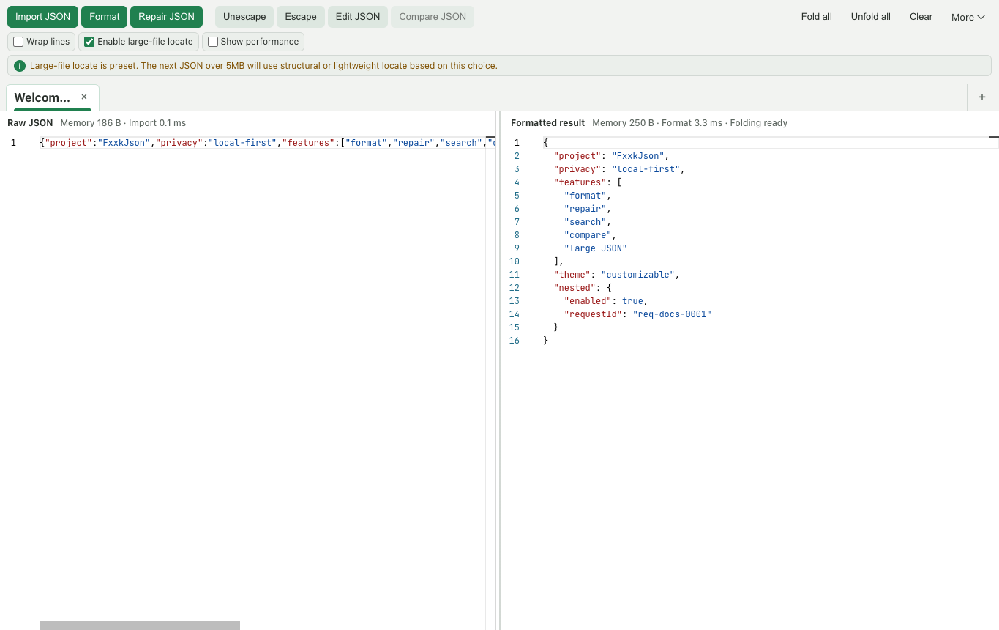
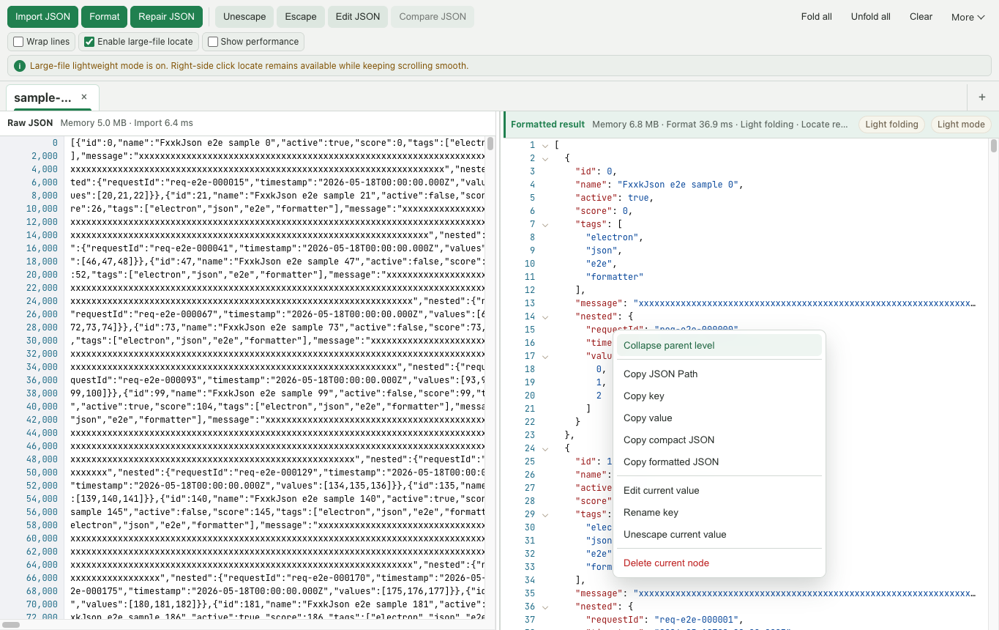
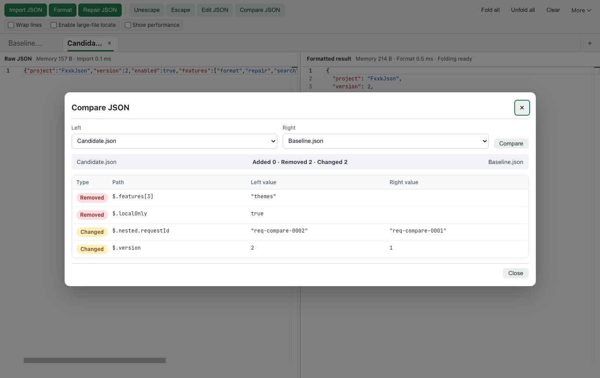
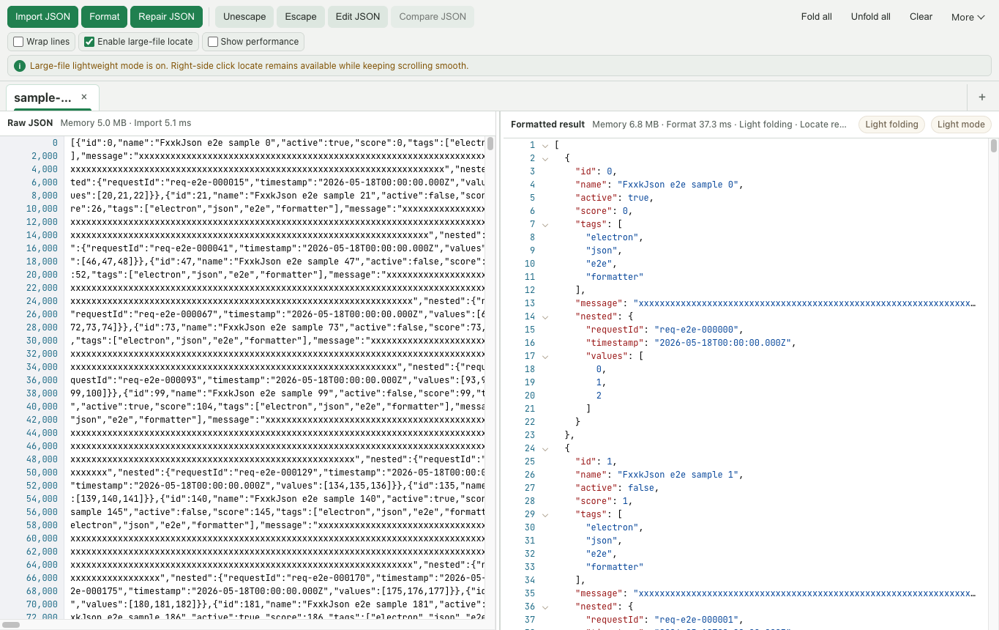

# FxxkJson User Guide

[简体中文](USER_GUIDE.md) · [Back to README](../README.en.md) · [Download the latest release](https://github.com/Aaronsound/FxxkJson/releases/latest)

FxxkJson is a local-first desktop JSON tool for importing, formatting, repairing, searching, editing, comparing, and browsing JSON—including files larger than 5MB. JSON content is processed on your machine.

## 1. Quick Start

1. Download the package for your system from [Latest Release](https://github.com/Aaronsound/FxxkJson/releases/latest):
   - Apple Silicon Mac (M1 / M2 / M3 / M4): `macos-arm64-*.dmg`
   - Intel Mac: `macos-x64-*.dmg`
   - Windows x64: `windows-x64-*.exe`
2. Open the app and add JSON in any of these ways:
   - Select a `.json` or `.txt` file with **Import JSON**.
   - Type or paste JSON into the left pane.
   - Drag a JSON file onto the app window.
3. Imported or pasted content is processed automatically. Select **Format** whenever you want to regenerate the right-side result.

> Current packages are unsigned, so macOS Gatekeeper or Windows SmartScreen may show a warning. Make sure the package came from this project's GitHub Releases page.

## 2. Main Window

- **Raw JSON on the left:** enter, paste, and modify source text; search and replace are available here.
- **Formatted result on the right:** inspect structure, search, fold, copy, or edit nodes.
- **Center splitter:** drag horizontally to resize the panes.
- **Top action area:** format, repair, escape, edit, compare, fold, and clear content.
- **Top view area:** line wrapping, large-file locate, and performance details.
- **Tab bar:** work with multiple JSON documents. Scroll buttons appear when needed, while the add button remains fixed on the right.

When the window is narrow, less-frequent actions move into the **More** menu instead of disappearing.

## 3. Format, Repair, and Transform

### Format JSON

Put content in the left pane and select **Format**. The indented result appears on the right. Folding and line wrapping on the right do not alter the raw source.

Formatting syntax errors with an available source location show a line, column, and **Locate error** action. Click it to scroll to and briefly highlight the raw text without editing or repairing it. Locations are invalidated after edits and refreshed by formatting. The parser detects the problem at this position, but its cause may be earlier; end-of-file errors highlight nearby text.

When the large-file raw viewer is read-only, use the existing **Edit JSON** action to open invalid raw text near the error; no successful repair is required first. **Update raw JSON** validates before saving. If validation fails, the dialog retains your draft and locates the error so you can keep editing. Cancel leaves the source unchanged. **Repair JSON** remains the automatic repair option.

### Repair JSON

Select **Repair JSON** when the input contains common non-standard syntax or malformed JSON. A successful repair updates and formats the document; otherwise the app reports an error.

Review important fields after a repair, especially before using the result as production configuration or an API request.

### Escape and Unescape

- **Escape** converts the current content into a JSON string representation.
- **Unescape** restores an escaped JSON string.
- The context menu in **Edit JSON** can transform either the selection or the whole document.

## 4. Search and Replace

1. Click the left or right pane to focus it.
2. Press `⌘F` / `Ctrl+F`, or `Alt+F`, to open search for that pane.
3. Use Previous and Next, and optionally enable Match case, Whole word, or Regular expression.
4. Left-side search supports Replace and Replace all. Right-side search is read-only and also offers recent searches and pinned JSON Paths.
5. Press `Esc` in the active pane to close its search widget.

Search results load in batches. Select **Load more** when a search has many matches. Previous/next navigation preserves loaded results. Rapid typing resolves to the latest query.

## 5. Fold, Copy, and Edit Nodes

Use the arrows beside objects and arrays in the right pane to expand or collapse nodes. **Fold all** and **Unfold all** are available from the toolbar.

Right-click a node in the formatted result to:

- expand or collapse the current node or its parent;
- copy its JSON Path, key, or value;
- copy compact or formatted JSON;
- edit its value or rename its key;
- unescape its value;
- delete the node.

Deletion requires confirmation. After a successful edit, rename, or deletion, the raw JSON and formatted result in the current tab are updated together.

## 6. Edit the Whole Document

Select **Edit JSON** to open the full-document editor. It supports search and code folding and is useful for concentrated multi-line changes.

- Select **Update raw JSON** to save and reformat.
- Select **Cancel** or press `Esc` to discard the edit.
- The action bar remains fixed, so buttons stay accessible in small windows and long documents.

## 7. Tabs and JSON Comparison

### Manage Tabs

- Select the fixed **+** button to create a tab.
- Select **×** on a tab to close it.
- Double-click or right-click a tab to rename it.
- Use the left and right scroll buttons when tabs overflow.
- When a tab has keyboard focus, use `←`, `→`, `Home`, or `End` to switch tabs.

### Compare JSON

1. Prepare at least two tabs containing valid JSON.
2. Select **Compare JSON**.
3. Choose the left and right tabs.
4. Select **Start comparison**.
5. The result lists added, removed, and changed fields by JSON Path, together with values from both sides.
6. If there are more than 2,000 differences, select **Load more** to continue. Use **Previous batch** and **Next batch** to revisit loaded results. Counts include only loaded differences until **Comparison complete** confirms the final total.
7. Select **View full values** below a difference path to inspect both JSON values. Long values are split into sections, with an option to jump to the last section. **Copy full value** copies the entire value, not just the visible section. Numeric precision is preserved; equivalent forms such as `1`, `1.0`, and `1e0` still compare equal.
   Long-value sections are read on demand. Returning to the list releases detail readers without discarding loaded differences; reopen a value to inspect it again.
8. The list renders nearby rows as you scroll without discarding other differences. **Back to differences** restores your previous scroll position and button focus. Use Tab / Shift+Tab to move continuously between value-inspection buttons.

## 8. Large-File Mode

When the raw or formatted document reaches 5MB, FxxkJson automatically enters large-file mode. The formatted pane uses a dedicated readonly viewer with virtual scrolling to prioritize responsive interaction.

Recommendations:

- Leave **Enable large-file locate** off when you do not need right-to-left navigation; this reduces indexing overhead.
- When locate is needed, enable it, wait until the status says it is ready, then click content on the right.
- Very large documents may use lightweight text mapping. Repeated content can result in an approximate location, and the current mode is shown in the UI.
- **Wrap lines** changes presentation only; it does not insert line breaks into the JSON.
- Enable **Show performance** to inspect read, format, render, and indexing time.

## 9. Appearance, Language, and More

Open **More** to access:

- **Diagnostics:** filter errors, warnings, and performance logs; copy a summary or diagnostics bundle.
- **Light/Dark mode:** switch the interface appearance.
- **Accent color:** Emerald, Mist blue, Graphite, Obsidian, Blue, Indigo, or Violet.
- **Language:** 简体中文 or English.
- **About:** view the app version, runtime architecture, and feature summary.

Language, accent color, and selected view preferences are stored locally.

## 10. Keyboard Shortcuts

| Action | macOS | Windows |
| --- | --- | --- |
| Paste | `⌘V` | `Ctrl+V` |
| Search the active pane | `⌘F` or `Alt+F` | `Ctrl+F` or `Alt+F` |
| Copy | `⌘C` | `Ctrl+C` |
| Select all | `⌘A` | `Ctrl+A` |
| Close the active search, menu, or dialog | `Esc` | `Esc` |
| Switch focused tabs | `←` / `→` / `Home` / `End` | `←` / `→` / `Home` / `End` |

## 11. Troubleshooting

### Why can't I type in the right pane?

The right pane is the formatted result. Modify raw text on the left, right-click a node and select **Edit current value**, or use **Edit JSON** for the whole document.

### Does line wrapping change my JSON?

No. It only wraps long content at the editor width.

### Why doesn't clicking the large-file result locate the raw JSON?

Enable **Enable large-file locate** and wait for the status to report that locate is ready. With locate disabled, the app prioritizes lower memory and indexing overhead.

### Why does my Apple Silicon Mac report Rosetta translation?

You installed the Intel x64 build. Install `macos-arm64-*.dmg` instead; large-file import and formatting should be more responsive.

### How should I report a problem?

Open **More → Diagnostics**, copy the diagnostics bundle, and create a [GitHub Issue](https://github.com/Aaronsound/FxxkJson/issues) with your operating system, app version, reproduction steps, and approximate file size. Remove credentials, tokens, personal data, and private JSON from logs and screenshots.
