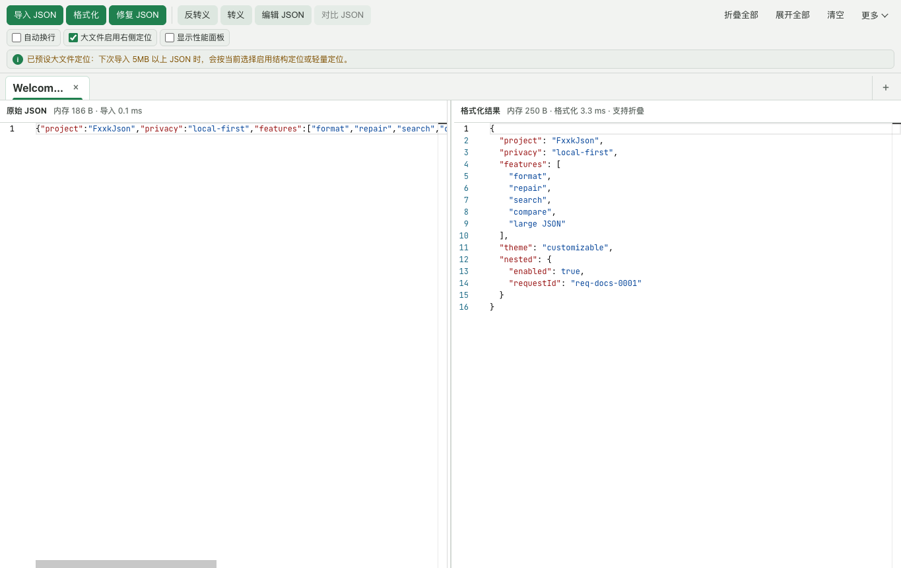
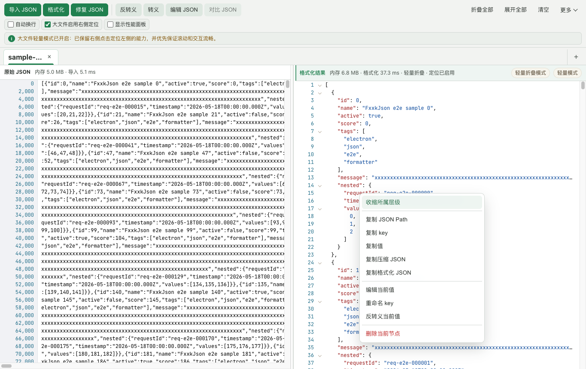
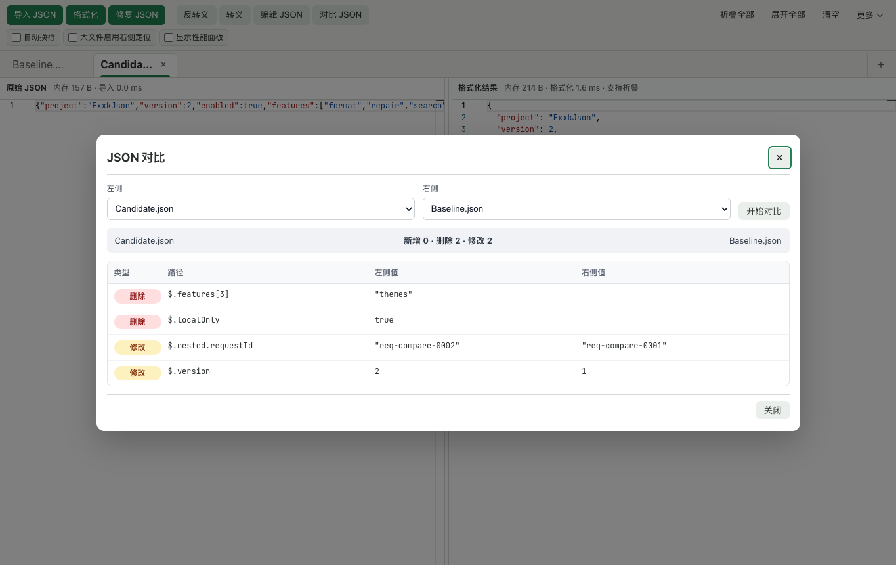
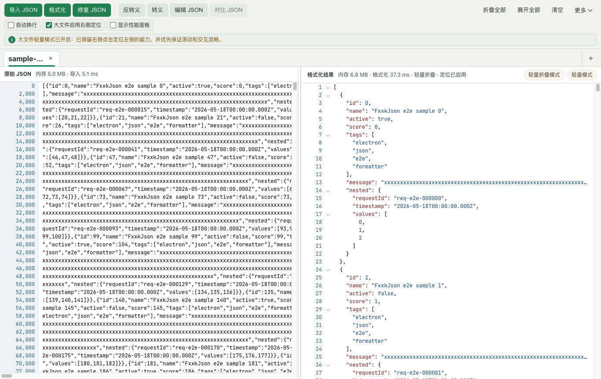

# FxxkJson 使用指南

[English](USER_GUIDE.en.md) · [返回项目首页](../README.md) · [下载最新版](https://github.com/Aaronsound/FxxkJson/releases/latest)

FxxkJson 是一款本地优先的桌面 JSON 工具。你可以用它导入、格式化、修复、搜索、编辑和对比 JSON，也可以浏览 5MB 以上的大文件。JSON 内容只在本机处理。

## 1. 快速开始

1. 从 [Latest Release](https://github.com/Aaronsound/FxxkJson/releases/latest) 下载与你的系统匹配的安装包：
   - Apple Silicon Mac（M1 / M2 / M3 / M4）：`macos-arm64-*.dmg`
   - Intel Mac：`macos-x64-*.dmg`
   - Windows x64：`windows-x64-*.exe`
2. 打开应用后，通过以下任一方式加入 JSON：
   - 点击“导入 JSON”选择 `.json` 或 `.txt` 文件；
   - 在左侧直接输入或粘贴 JSON；
   - 把 JSON 文件拖到应用窗口中。
3. 导入或粘贴后应用会自动处理；也可以随时点击“格式化”重新生成右侧结果。

> 当前安装包尚未签名，macOS Gatekeeper 或 Windows SmartScreen 可能显示安全提示。请确认安装包来自本项目的 GitHub Releases 页面。

## 2. 认识主界面

- **左侧“原始 JSON”**：输入、粘贴和修改原始文本，也支持搜索与替换。
- **右侧“格式化结果”**：查看格式化结构，搜索、折叠、复制或编辑节点。
- **中间分隔线**：左右拖动以调整两侧宽度。
- **顶部操作区**：格式化、修复、转义、编辑、对比、折叠和清空。
- **顶部视图区**：自动换行、大文件定位和性能面板。
- **标签栏**：同时处理多个 JSON；标签过多时使用左右滚动按钮，右侧“+”始终用于新建标签。

窗口变窄时，部分操作会收进“更多”菜单，功能不会消失。

## 3. 格式化、修复和转义

### 格式化 JSON

把内容放入左侧并点击“格式化”。右侧会显示缩进后的结果；左侧原始文本不会被右侧的折叠或自动换行修改。

### 修复 JSON

当输入包含常见的非标准格式或语法问题时，点击“修复 JSON”。修复成功后会更新并重新格式化；如果无法可靠修复，界面会显示错误信息。

建议在修复后检查关键字段，尤其是用于生产配置或接口请求的内容。

### 转义与反转义

- “转义”把当前内容转换为 JSON 字符串形式。
- “反转义”还原已转义的 JSON 字符串。
- “编辑 JSON”弹窗的右键菜单还支持只处理选中内容或整段内容。

## 4. 搜索和替换

1. 先点击左侧或右侧，使目标区域获得焦点。
2. 按 `⌘F` / `Ctrl+F`，或按 `Alt+F` 打开对应一侧的搜索框。
3. 使用上一个、下一个按钮浏览匹配项，并按需开启区分大小写、全词匹配或正则表达式。
4. 左侧搜索支持单次替换和全部替换；右侧是只读搜索，并支持最近搜索和固定 JSON Path。
5. 在当前一侧按 `Esc` 关闭搜索框。

大文件搜索会分批加载结果；匹配很多时可以点击“加载更多”。

## 5. 折叠、复制和编辑节点

右侧对象或数组左边的箭头可以展开或折叠节点。也可以使用顶部的“折叠全部”和“展开全部”。

在右侧某个节点上点击鼠标右键，可以使用：

- 展开或收缩当前节点、所属层级；
- 复制 JSON Path、key、值；
- 复制压缩 JSON 或格式化 JSON；
- 编辑当前值、重命名 key；
- 反转义当前值；
- 删除当前节点。

删除会先显示确认弹窗。编辑、重命名或删除成功后，当前标签的原始 JSON 和格式化结果会同步更新。

## 6. 编辑完整 JSON

点击“编辑 JSON”打开完整编辑弹窗。这里适合集中修改多行内容，也支持搜索和代码折叠。

- 点击“更新为原始 JSON”保存修改并重新格式化。
- 点击“取消”或按 `Esc` 放弃本次修改。
- 底部操作栏固定显示，小窗口和长文档下不需要滚到末尾找按钮。

## 7. 多标签和 JSON 对比

### 管理标签

- 点击标签栏右侧“+”新建标签。
- 点击标签上的“×”关闭。
- 双击标签或右键标签可以重命名。
- 标签溢出时使用左右滚动按钮。
- 标签获得键盘焦点后，可用 `←`、`→`、`Home`、`End` 切换。

### 对比 JSON

1. 准备至少两个包含有效 JSON 的标签。
2. 点击“对比 JSON”。
3. 分别选择左侧和右侧标签。
4. 点击“开始对比”。
5. 结果会按 JSON Path 列出新增、删除和修改字段，以及两侧的值。
6. 差异超过 2,000 处时，点击“继续加载”逐批查看剩余差异；用“上一批”“下一批”查看已加载结果。加载期间的统计仅包含已加载差异，显示“已完成全部对比”后才是最终总数。

## 8. 大文件模式

原始内容或格式化结果达到 5MB 后，应用会自动进入大文件模式。右侧使用专用只读查看器和虚拟滚动，优先保持滚动及交互响应。

使用建议：

- 不需要从右侧反向定位左侧时，不勾选“大文件启用右侧定位”，可以减少索引开销。
- 需要定位时勾选该选项，等待状态提示定位就绪，再点击右侧内容。
- 超大文件可能使用轻量文本定位；重复内容有时只能定位到近似位置，界面会明确提示当前定位模式。
- “自动换行”只改变显示方式，不会在 JSON 中插入换行符。
- 勾选“显示性能面板”可以查看读取、格式化、渲染和索引耗时。

## 9. 外观、语言和更多功能

点击“更多”可以访问：

- **诊断日志**：筛选错误、警告和性能日志，复制诊断摘要或诊断包。
- **浅色/深色模式**：切换界面明暗外观。
- **主题色**：翡翠绿、雾蓝、石墨灰、曜石黑、湖蓝、靛青和紫罗兰。
- **语言**：简体中文或 English。
- **关于**：查看版本、运行架构和功能摘要。

语言、主题色和部分视图偏好会保存在本机。

## 10. 常用快捷键

| 操作 | macOS | Windows |
| --- | --- | --- |
| 粘贴 | `⌘V` | `Ctrl+V` |
| 在当前侧搜索 | `⌘F` 或 `Alt+F` | `Ctrl+F` 或 `Alt+F` |
| 复制 | `⌘C` | `Ctrl+C` |
| 全选 | `⌘A` | `Ctrl+A` |
| 关闭当前搜索、菜单或弹窗 | `Esc` | `Esc` |
| 切换已聚焦的标签 | `←` / `→` / `Home` / `End` | `←` / `→` / `Home` / `End` |

## 11. 常见问题

### 为什么右侧内容不能直接输入？

右侧是格式化结果视图。请在左侧修改原始文本，或右键右侧节点选择“编辑当前值”；需要编辑完整文档时使用“编辑 JSON”。

### 自动换行会改变 JSON 吗？

不会。它只让超出编辑区宽度的长内容折行显示。

### 为什么大文件点击右侧没有定位到左侧？

先勾选“大文件启用右侧定位”，并等待顶部状态变为定位就绪。关闭定位时，应用会优先降低内存和索引开销。

### 为什么 Apple Silicon Mac 提示正在使用 Rosetta？

你安装了 Intel x64 包。请改用 `macos-arm64-*.dmg`，大文件导入和格式化通常会更流畅。

### 遇到错误时如何反馈？

打开“更多 → 诊断日志”，复制诊断包，并在 [GitHub Issues](https://github.com/Aaronsound/FxxkJson/issues) 中说明系统、应用版本、复现步骤和文件大致体积。请删除 JSON、日志和截图中的密钥、token 或个人数据。
